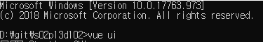
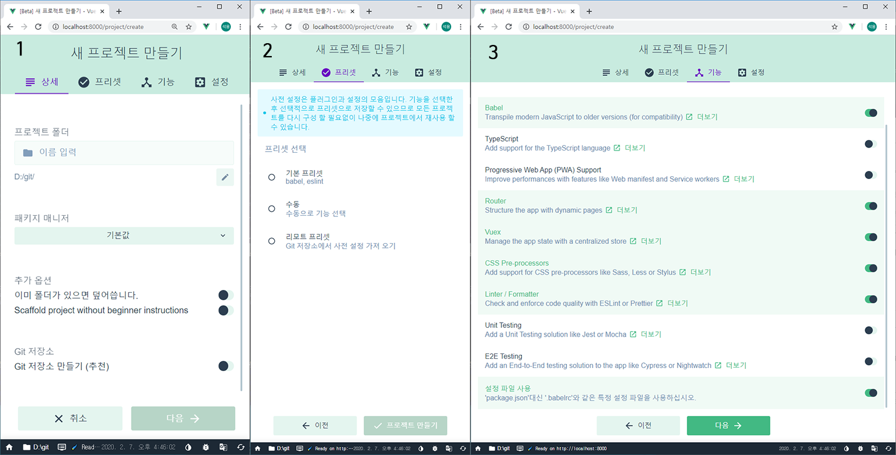

# README

# 저장소 설명

## 개요
여행경로 공유 웹 SNS

개발 기간 : 2020.01.13 ~ 2020.02.21 (6주)

서버 파트 : 류가연

## back-sk : 백엔드 서버

### 사용한 개발 도구

- Spring Boot
    - Spring Web
    - Spring Bood DevTools
- Maven
- Java

## front-sk : 프론트 서버

### 사용한 개발 도구

- Vue.js CLI 3
    - Vue-Router
    - esLint
    - email-validator
    - babel
    - password-validator
- CSS-Preprocessor(node-sass)
    - scss
- JavaScript

---

# 프론트/백엔드 프로젝트 사용방법(Based by Windows 10)

## 프론트 환경 구축

1. Node.js LTS버전 설치
2. 명령 프롬프트 창에서 npm install -g  @vue/cli를 입력해서 vue.js를 설치

## 백엔드 환경 구축

JAVA 8 설치 필수

### VSCode

1. VSCode 설치
2. 키보드에서 'Ctrl' + 'Shift' + 'X' 조합키를 누른 후 아래 목록을 전부 설치한다.
    - Spring Boot Extension Pack
    - Java Extension Pack
    - Maven for Java

### STS

Spring 홈페이지([https://spring.io/](https://spring.io/))에서 개발도구(STS)를 설치한다. [3.9.7 버전 혹은 이상의 안정된 버전 권장]

### DB

maria DB 사용
데이터베이스 이름은 routripdb, 포트번호는 3306
테이블 생성은 wireframe 폴더의 create table sql query문.txt 참고

# 프로젝트 실행

## Common

http://52.78.8.59:8083/ 로 접속

## Developer

git 프로젝트를 다운로드 한다.

- git을 이용한 방법

    ⭐git이 먼저 설치되어 있어야 한다.

    1. git bash를 실행한다.
    2. cd명령어를 이용해 프로젝트를 다운받을 폴더로 이동한다.
    3. 아래 명령어를 입력한다.

        git clone https://lab.ssafy.com/webmobile2-sub3/s02p13d102.git

- 다운로드 링크를 이용한 방법
    1. 프로젝트 파일 리스트 화면 상단 오른쪽에 있는 구름모양 아이콘 클릭
    2. zip 다운로드 클릭

## - Front Project

1. cmd(명령 프롬프트)창에서 vue ui를 입력한다. 이때 cmd는 vue프로젝트를 설치할 로컬 디스크에 포커스 시키면된다.

    

    front프로젝트를 D드라이브에 보관할 경우 cmd경로 예시

2. 집 모양 아이콘을 클릭해서 '프로젝트 매니저'로 이동 한다.

    

3. 만들기 탭을 누른 후 프로젝트를 생성할 폴더를 찾은 후 하단의 '새 프로젝트를 만들어 보세요' 버튼을 클릭한다.
4. 프로젝트 설정(아래 이미지 참고)
    1. 폴더 이름을 작성하고 패키지 메니저는 npm이나 yarn 중 사용하기 익숙한 것을 고르고 다음 버튼을 누른다.
    2. 수동을 누른 후 다음 버튼 클릭
    3. 이미지대로 설정을 한 후 다음버튼 클릭
    4. scss는 node-sass를 선택하고 eslint + prettier를 선택하고 프로젝트 만들기 클릭
    5. 저장하지 않고 진행을 클릭하면 기반 프로젝트가 생성이 된다.

    

5. 다운받은 프로젝트의 front_sk폴더안에 있는 파일들을 전부 새로 생성한 프로젝트에 이동한다.
6. 다시 vue ui를 실행해서 켜진 창으로 이동하여 플러그인과 의존성 탭을 클릭해서 다운로드 버튼을 클릭하여 필요한 라이브러리를 다운받으면 되고  중복되는 내용은 휴지통 아이콘을 클릭하여 삭제를 하면된다.
7. 이후 작업목록에서 serve를 클릭한 후 실행을 누르거나 vue 프로젝트가 포커스 되어 있는 cmd창에서 npm serve run 또는 yarn serve를 입력하여 서버를 실행하면 웹페이지 사용이 가능하다.

## - Back Project

1. 위 설명을 참고해 STS 설치와 DB 구축을 한다.
2. wireframe 폴더 안의 'pom.xml 내용물.txt' 안의 내용을 복사하여 pom.xml 파일을 만들어 그 안에 넣는다.
3. 만들어진 pom.xml 파일을 back-sk 폴더 안에 넣는다.
4. STS 를 실행하여 File-Import-Maven-Existing Maven Projects 를 선택하여 Root Directory 에서 back-sk 폴더를 선택한 후 Finish 를 누른다.
5. STS 에서 가져온 프로젝트에서 WebCurationApplication.java 를 찾아 오른쪽 버튼을 클릭
6. Run As-Spring Boot App 을 클릭하면 서버가 실행된다.